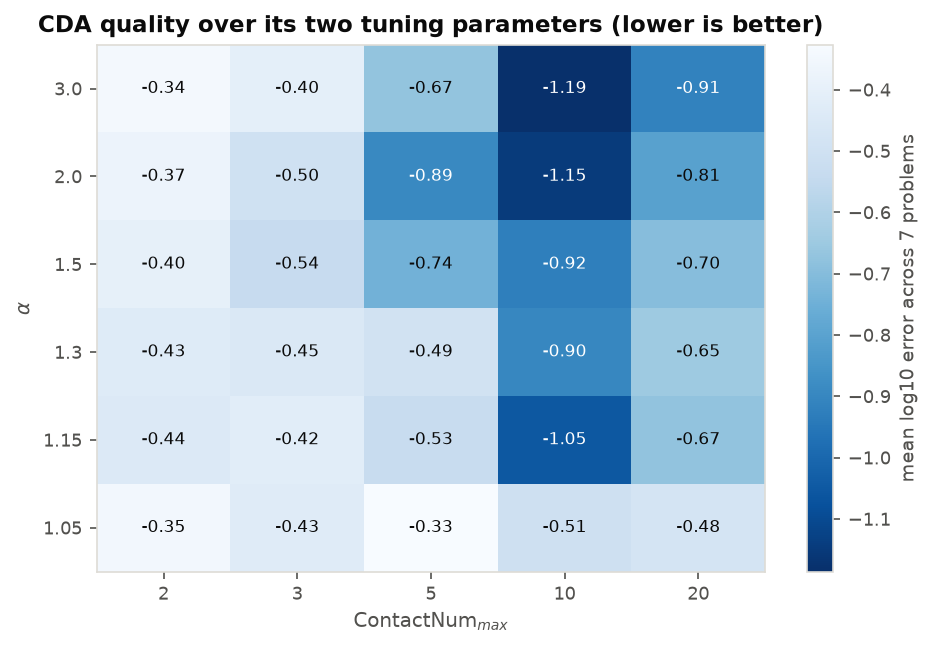
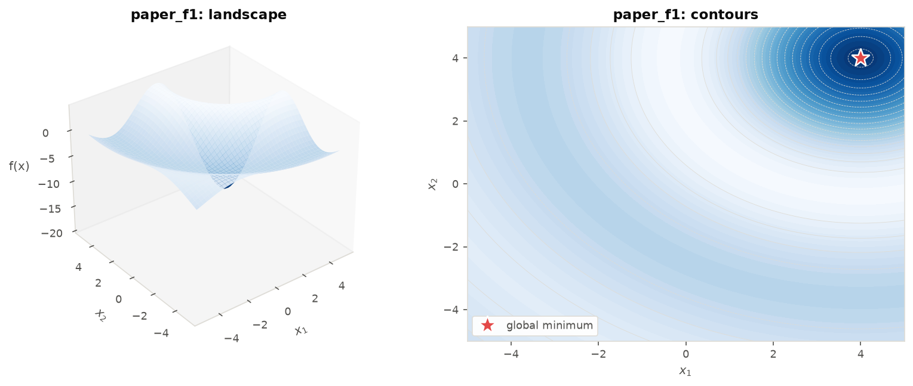
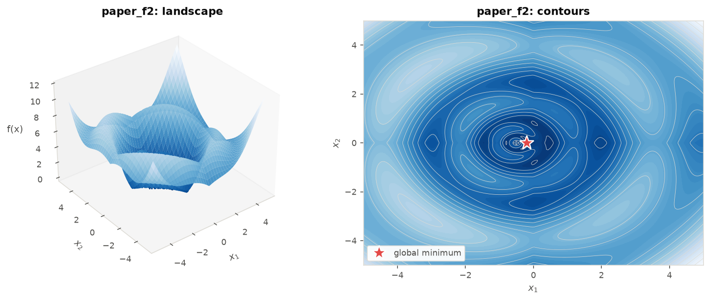
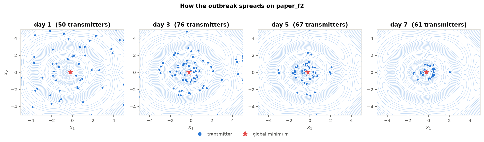
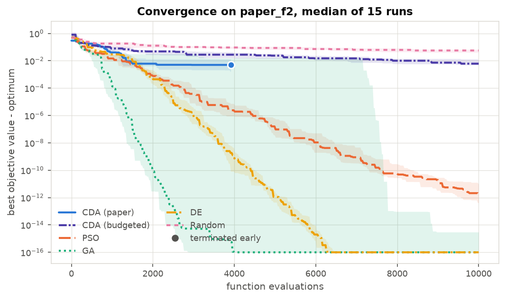
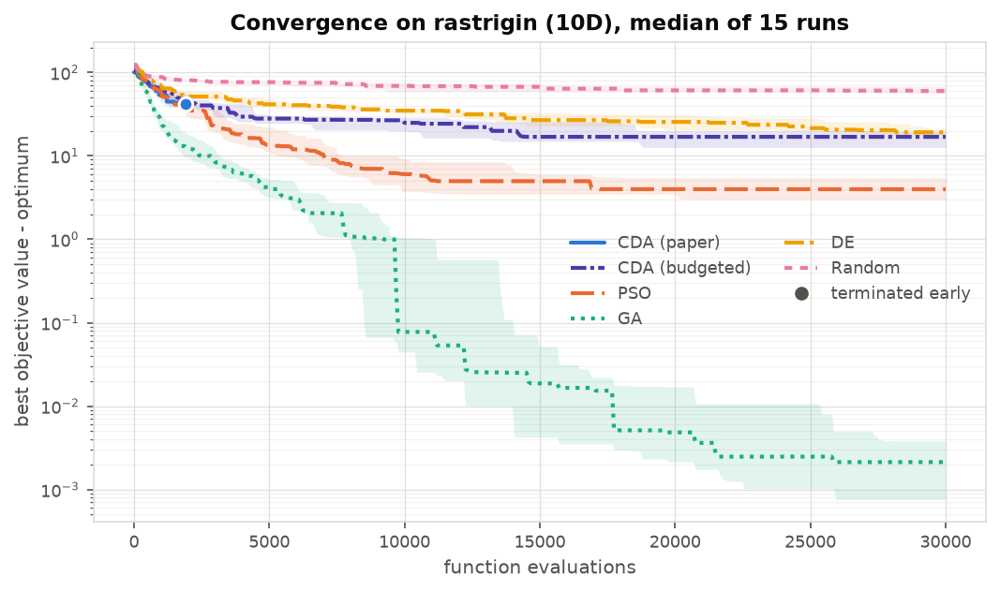
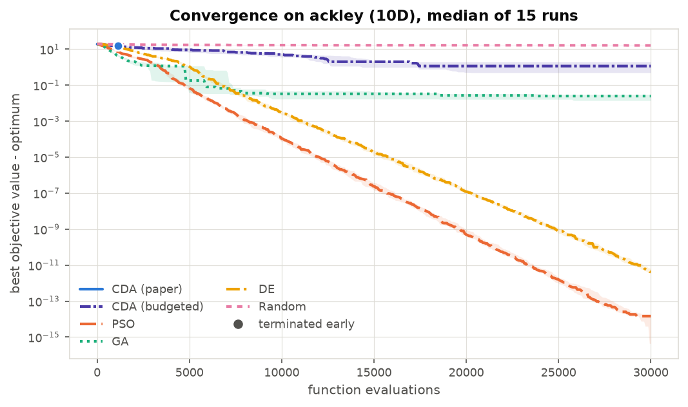
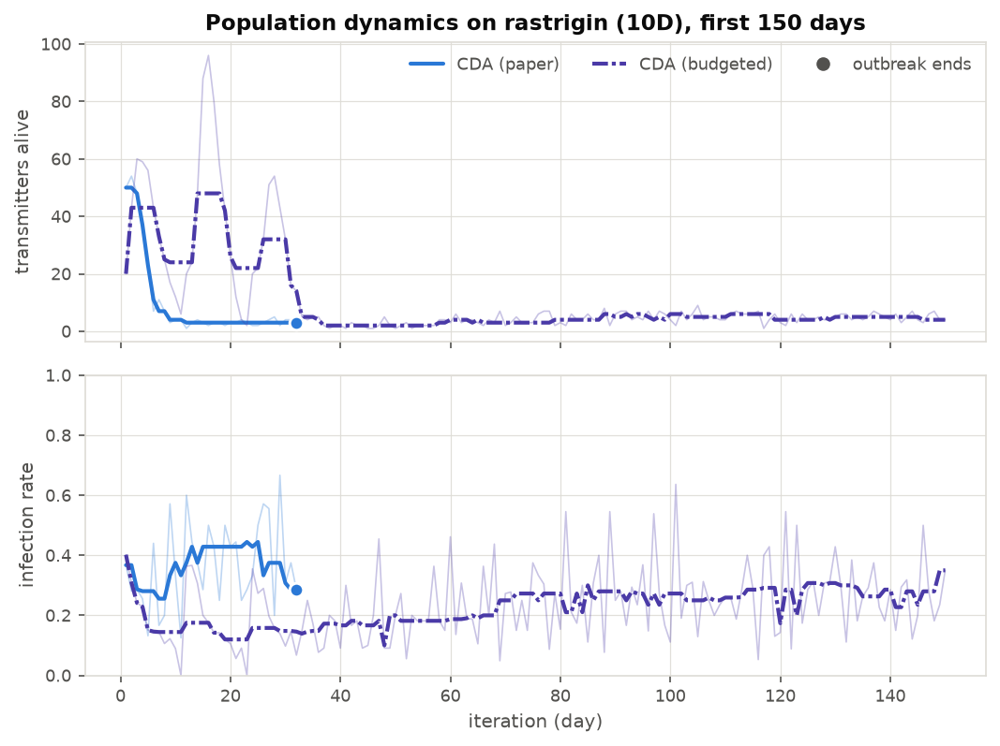
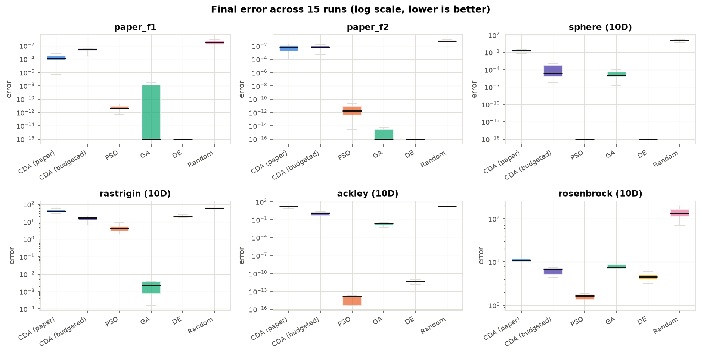

# Contagious Diseases Algorithm (CDA)

A Python implementation of an optimisation algorithm that copies how an epidemic
spreads through a town.

The algorithm was published in 2010 by Aidin Mohammadi, Mohammad Reza Farmani
and Caro Lucas. This repository contains a from-scratch implementation of it, a
benchmark suite, four competing optimisers to compare it against, and the
measured results.

**Every number in this README was produced by running the code in this
repository.** Nothing is quoted from the original paper.

---

## The idea, in plain language

Imagine a town where a new disease has appeared. A few people are already
infected and do not know it yet, so they carry on with their lives and meet
other people. Whether someone they meet actually catches it depends on how
healthy that person is. Someone in poor health catches it; someone healthier
shrugs it off.

Two more things happen, and these are what make the story useful:

1. **Sick people in poor conditions infect more people.** Someone with no access
   to sanitation meets many people and passes it on widely. Someone in better
   conditions passes it on to almost nobody.
2. **People in better conditions travel further.** They meet people from across
   town. Someone in poor conditions only meets their immediate neighbours. And
   as the outbreak goes on and the town becomes aware of it, everybody's travel
   gets shorter.

Now swap the words. The town is the space of all possible answers to your
problem. A person is one candidate answer. How healthy they are is how *bad*
that answer is. The disease is the search, and it always moves toward less
healthy people. So an epidemic left to run finds the least healthy person in
town, which is to say the best answer to your problem.

That is the whole algorithm. The infection spreads downhill, and downhill is
where the optimum lives.

### The translation table

| In the story | In the optimiser |
| --- | --- |
| The town | The search space, rescaled so every axis runs from 0 to 1 |
| A person | One candidate solution |
| Health care factor of a person | The objective value at that point, which we are minimising |
| A transmitter | A candidate that is currently spreading the search |
| A high-risk contact | One step from a transmitter to a nearby point |
| Catching the disease | The new point is no worse, so it is kept |
| Shrugging it off | The new point is worse, so it is discarded |
| Going into quarantine | The parent is dropped after its contacts are made |
| One day of the outbreak | One iteration |
| The outbreak dying out | Nothing improved anywhere, so the algorithm stops |

The paper's own name for the objective value is **health care factor**, or HCF,
and the rest of this README uses that name where it helps keep the metaphor
straight.

---

## How it works

```
initialise N transmitters, spread across the normalised search space
evaluate their HCF

for each day m = 1, 2, 3, ...:

    for each transmitter i:
        work out how many contacts it makes         (Equation 1)
        work out how far those contacts reach       (Equation 2)
        for each contact:
            pick a uniformly random direction
            pick a distance from a normal distribution
            the contacted individual is at that offset

    evaluate the HCF of every contacted individual

    an individual catches the disease iff HCF(individual) <= HCF(its transmitter)
    the infected individuals become tomorrow's transmitters
    yesterday's transmitters go into quarantine and are dropped

    stop if nobody was infected,
      or if the surviving transmitters all share the same HCF,
      or if the iteration limit is reached
```

### Equation 1: how many contacts

Let `r` run from 1 for the best transmitter in the current population down to 0
for the worst:

```
r_i = (HCF_i - HCF_max) / (HCF_min - HCF_max)

ContactNum_i = floor( r_i * (ContactNum_max - 1) ) + 1
```

The best transmitter makes the most contacts and the worst makes exactly one.
Effort concentrates around the promising solutions.

### Equation 2: how far the contacts reach

Each contact's distance is drawn from a normal distribution centred on the
transmitter. Its standard deviation is:

```
sigma_i = r_i * ( sigma_min(m) - sigma_max ) + sigma_max

sigma_max = 1/6                        the coarsest step, fixed
sigma_min(m) = 1 / (6 * alpha^(m-1))   the finest step, shrinking every day
```

So the *worst* transmitter takes big exploratory steps across the whole space,
the *best* one takes small careful steps, and everybody's steps shrink as the
days pass. `alpha` controls how fast that shrinking happens.

Those two equations working together are the interesting part of CDA: a single
quantity, how good a solution is, controls both how much the algorithm branches
out from that solution and how far it reaches. Good solutions get refined
finely and often. Bad solutions get one long shot in a random direction.

---

## Characteristics

| Property | CDA |
| --- | --- |
| Problem type | Single-objective, continuous, box-constrained minimisation |
| Derivative required | None, the objective is treated as a black box |
| Population size | **Variable**, decided each iteration by how many contacts got infected |
| Selection | Each child competes only with its own parent, not with the population |
| Elitism | None by construction, parents are always discarded after reproducing |
| Step size | Adapts per solution by rank, and decays geometrically with iteration |
| Branching factor | Adapts per solution by rank, from 1 up to `ContactNum_max` |
| Memory between iterations | None, no velocity, no pheromone, no archive |
| Information sharing | None, transmitters never mix; there is no crossover |
| Termination | Self-terminating, the outbreak dies out on its own |
| Tuning parameters | Two that matter: `alpha` and `ContactNum_max` |
| Parallelism | Every contact in a day is independent, so an iteration parallelises freely |
| Search space assumption | Requires normalised axes, since `sigma_max = 1/6` is an absolute step |

### Where it is strong

- **It costs very little to get a good first answer.** On easy landscapes it
  reaches a good solution in a few hundred evaluations and then stops by itself.
  You do not have to pick an iteration budget in advance.
- **It has almost no moving parts.** No velocities, no crossover operators, no
  temperature schedule, no archive. Two parameters do the work.
- **The population sizes itself.** On a promising landscape many contacts get
  infected and the population swells; on a hostile one it shrinks and the run
  ends rather than burning evaluations.

### Where it is weak

These are measured, not hypothetical, and the numbers are further down.

- **It converges prematurely.** `sigma` is multiplied by `1/alpha` every single
  iteration, so with the paper's `alpha = 2` the step size falls below `10e-7`
  after about twenty days and the search freezes wherever it happens to be.
- **It cannot use a large budget.** Because it stops by itself, it typically
  spends only a few hundred to a few thousand evaluations no matter how many it
  is given. On a 10-dimensional Rastrigin it stops after roughly 900 of 30,000.
- **Transmitters never share what they learn.** There is no crossover and no
  global best, so two transmitters in different valleys never combine anything.
  Each lineage is an independent hill descent.
- **The step size is absolute, not relative to the problem.** `sigma_max = 1/6`
  only means anything because the search space is rescaled to the unit cube. On
  a badly scaled problem that assumption breaks.

---

## Two notes on the specification

Implementing the paper carefully turned up two things worth recording.

### Equation 2 is typeset with its terms swapped

The manuscript prints Equation 2 as:

```
sigma_i = r_i * ( 1/6 - 1/(6 * alpha^(m-1)) ) + 1/6
```

With `r = 1` for the best transmitter, this makes the *best* solution's standard
deviation approach `1/3`, which is twice the stated maximum, and it makes the
step size *grow* over time. That contradicts the surrounding prose, which says
plainly that `1/6` is the maximum standard deviation, that the minimum "will be
decreased by increase in iteration number", and that "by decreasing the HCF
values the radiuses will be decreased".

The reading that matches the prose is a plain interpolation between the
shrinking minimum and the fixed maximum, and that is what this implementation
uses by default:

```
sigma_i = r_i * ( 1/(6 * alpha^(m-1)) - 1/6 ) + 1/6
```

The typeset version is still available with `sigma_formula="literal"`, and the
two are measured against each other in the results below. The corrected version
is better by roughly an order of magnitude.

### The optima of both test functions were computed, not assumed

The manuscript defines its two test functions but this implementation does not
take their optima on trust. Test function 1 has a closed form at its centre:

```
f1(4, 4) = -20 * sin(0.1) / 0.1 = -19.96668333
```

Test function 2 has no closed form, so its optimum was located by a grid search
over 9 million points followed by Nelder-Mead refinement from the 400 best
starts:

```
-0.24740519  at  (-0.20214994, 0)
```

Both values are asserted in the test suite, and every optimum in the benchmark
suite is checked the same way: the test evaluates the function at its recorded
minimiser and compares.

---

## Results

Every number below is generated from the CSV files in [`results/`](results/) by
`experiments/make_readme_tables.py`, and every CSV is produced by a script in
[`experiments/`](experiments/). Protocol: 30 independent seeded runs per
algorithm per problem, identical evaluation budgets for every algorithm
(10,000 in 2D, 30,000 in 10D, 60,000 in 30D), and a run counts as a success when
it gets within `1e-4` of the known optimum.

Two CDA configurations are reported throughout:

- **CDA (paper)** is Table 1 of the manuscript: 50 transmitters, `alpha = 2`,
  and it stops the moment the outbreak dies out. This is the faithful version.
- **CDA (budgeted)** slows the step decay to `alpha = 1.15`, raises
  `ContactNum_max` to 10, drops to 20 transmitters, and starts a fresh outbreak
  whenever the previous one dies out, so that it actually spends its budget.
  These settings come from the sweep in `experiments/run_sensitivity.py`.

### Reproducing the paper's own two test functions

<!-- BEGIN:PAPER_FUNCTIONS -->
**paper_f1** (true global optimum -19.966683)

| algorithm | best | median | best solution | hit rate | median evals to optimum |
| --- | ---: | ---: | ---: | ---: | ---: |
| CDA | -19.966683 | -19.966534 | (4, 4) | 90% | 3241 |
| CDA (budgeted) | -19.966397 | -19.963914 | (3.9999, 3.9996) | 10% | 6275 |
| PSO | -19.966683 | -19.966683 | (4, 4) | 100% | 1625 |
| GA | -19.966683 | -19.966683 | (4, 4) | 100% | 65 |
| DE | -19.966683 | -19.966683 | (4, 4) | 100% | 13 |
| Random | -19.962168 | -19.93894 | (4.0058, 3.9969) | 0% | - |

**paper_f2** (true global optimum -0.247405)

| algorithm | best | median | best solution | hit rate | median evals to optimum |
| --- | ---: | ---: | ---: | ---: | ---: |
| CDA | -0.247405 | -0.244512 | (-0.2022, 1.16e-07) | 27% | 161 |
| CDA (budgeted) | -0.246916 | -0.24095 | (-0.2048, 6.09e-05) | 3% | 9432 |
| PSO | -0.247405 | -0.247405 | (-0.2021, -1.78e-15) | 100% | 205 |
| GA | -0.247405 | -0.247405 | (-0.2021, 0) | 90% | 105 |
| DE | -0.247405 | -0.247405 | (-0.2021, 0) | 100% | 2 |
| Random | -0.240257 | -0.20036 | (-0.2095, 0.004) | 0% | - |
<!-- END:PAPER_FUNCTIONS -->

CDA in its faithful configuration reaches the true global optimum of both
functions. It does so, however, less reliably and with more evaluations than the
baselines: on both problems PSO, GA and DE hit the optimum in every run or
nearly every run, while CDA hits it in a minority of runs on test function 2.
These two functions are two-dimensional and easy, and every method except random
search solves them.

### The wider benchmark suite

28 problems, from 2 to 30 dimensions, unimodal and multimodal.

<!-- BEGIN:RANKS -->
| algorithm | average rank (1 = best) | problems |
| --- | ---: | ---: |
| DE | 1.86 | 28 |
| PSO | 1.95 | 28 |
| GA | 2.54 | 28 |
| CDA (budgeted) | 4.09 | 28 |
| CDA (paper) | 4.68 | 28 |
| Random | 5.89 | 28 |
<!-- END:RANKS -->

Median final objective value per problem, best in bold:

<!-- BEGIN:SUMMARY -->
| problem (median final value) | CDA (paper) | CDA (budgeted) | PSO | GA | DE | Random |
| --- | ---: | ---: | ---: | ---: | ---: | ---: |
| ackley_10d | 14.4434 | 1.1738 | **7.55e-15** | 0.0198 | 4.21e-12 | 16.3678 |
| ackley_2d | 0.426 | 0.1099 | 4.35e-10 | 4.44e-16 | **4.44e-16** | 2.6882 |
| ackley_30d | 19.7253 | 3.8059 | 1.2478 | 0.0144 | **1.74e-08** | 19.7403 |
| booth | 3.13e-08 | 3.72e-04 | 7.99e-20 | 1.16e-06 | **0** | 0.0183 |
| branin | 0.3979 | 0.3981 | 0.3979 | 0.3979 | **0.3979** | 0.4024 |
| easom | -2.20e-35 | -0.9946 | -1 | -1 | **-1** | -0.1368 |
| griewank_10d | 1.6069 | 0.6719 | **0.0615** | 0.0875 | 0.081 | 37.851 |
| griewank_30d | 9.8768 | 1.1724 | 0.0086 | 0.0336 | **1.18e-14** | 352.0928 |
| himmelblau | 5.92e-08 | 4.59e-04 | 4.50e-20 | 8.53e-14 | **0** | 0.0233 |
| levy_10d | 3.8618 | 0.0016 | **4.49e-30** | 2.65e-05 | 2.03e-24 | 9.0638 |
| michalewicz_10d | -5.1545 | -7.7736 | -8.4822 | **-9.6169** | -8.276 | -5.036 |
| michalewicz_2d | -1.8013 | -1.8013 | -1.8013 | -1.8013 | **-1.8013** | -1.7951 |
| paper_f1 | -19.9665 | -19.9639 | -19.9667 | -19.9667 | **-19.9667** | -19.9389 |
| paper_f2 | -0.2445 | -0.241 | -0.2474 | -0.2474 | **-0.2474** | -0.2004 |
| rastrigin_10d | 41.5131 | 16.9209 | 4.4773 | **0.0037** | 20.3355 | 63.3542 |
| rastrigin_2d | 0.8983 | 0.0347 | 0 | 0 | **0** | 0.634 |
| rastrigin_30d | 247.8465 | 113.9371 | 102.5157 | **0.0105** | 131.3135 | 329.8165 |
| rosenbrock_10d | 10.9363 | 7.0742 | **1.6641** | 7.6666 | 4.2642 | 144.7566 |
| rosenbrock_2d | 1.73e-05 | 5.96e-04 | 3.61e-11 | 0.0053 | **0** | 0.0049 |
| rosenbrock_30d | 162.9253 | 37.9005 | **21.2828** | 27.4993 | 25.5894 | 2915.7437 |
| schwefel_10d | 1598.2704 | 1011.1529 | 713.6641 | 473.756 | **264.1263** | 1723.1336 |
| six_hump_camel | -1.0316 | -1.0316 | -1.0316 | -1.0316 | **-1.0316** | -1.0299 |
| sphere_10d | 0.1718 | 2.69e-05 | **0** | 1.15e-05 | 2.94e-25 | 10.7339 |
| sphere_2d | 2.69e-09 | 3.05e-05 | 1.24e-21 | 0 | **0** | 0.0032 |
| sphere_30d | 2.9062 | 0.1165 | **1.38e-24** | 1.55e-05 | 7.07e-18 | 102.2632 |
| step_10d | 39.5 | **0** | 0 | 0 | 0 | 4092.5 |
| step_30d | 1296 | 110 | 1 | 0 | **0** | 39151.5 |
| zakharov_10d | 26.6917 | 0.0219 | **5.67e-17** | 2.0575 | 1.03e-16 | 38.8273 |
<!-- END:SUMMARY -->

Share of the 30 runs that reached within `1e-4` of the known optimum:

<!-- BEGIN:SUCCESS -->
| problem (success rate) | CDA (paper) | CDA (budgeted) | PSO | GA | DE | Random |
| --- | ---: | ---: | ---: | ---: | ---: | ---: |
| ackley_10d | 0% | 0% | 100% | 0% | 100% | 0% |
| ackley_2d | 0% | 0% | 100% | 90% | 100% | 0% |
| ackley_30d | 0% | 0% | 43% | 0% | 100% | 0% |
| booth | 100% | 7% | 100% | 70% | 100% | 3% |
| branin | 100% | 30% | 100% | 90% | 100% | 3% |
| easom | 0% | 3% | 100% | 77% | 100% | 0% |
| griewank_10d | 0% | 0% | 0% | 0% | 7% | 0% |
| griewank_30d | 0% | 0% | 43% | 0% | 87% | 0% |
| himmelblau | 100% | 3% | 100% | 90% | 100% | 0% |
| levy_10d | 0% | 3% | 100% | 70% | 100% | 0% |
| michalewicz_10d | 0% | 0% | 0% | 7% | 0% | 0% |
| michalewicz_2d | 70% | 73% | 100% | 97% | 100% | 0% |
| paper_f1 | 37% | 0% | 100% | 87% | 100% | 0% |
| paper_f2 | 7% | 0% | 100% | 87% | 100% | 0% |
| rastrigin_10d | 0% | 0% | 0% | 0% | 0% | 0% |
| rastrigin_2d | 10% | 3% | 100% | 90% | 100% | 0% |
| rastrigin_30d | 0% | 0% | 0% | 0% | 0% | 0% |
| rosenbrock_10d | 0% | 0% | 0% | 0% | 0% | 0% |
| rosenbrock_2d | 67% | 10% | 100% | 13% | 100% | 3% |
| rosenbrock_30d | 0% | 0% | 0% | 0% | 0% | 0% |
| schwefel_10d | 0% | 0% | 0% | 0% | 0% | 0% |
| six_hump_camel | 100% | 73% | 100% | 97% | 100% | 0% |
| sphere_10d | 0% | 63% | 100% | 90% | 100% | 0% |
| sphere_2d | 100% | 90% | 100% | 100% | 100% | 0% |
| sphere_30d | 0% | 0% | 97% | 100% | 100% | 0% |
| step_10d | 0% | 57% | 100% | 100% | 100% | 0% |
| step_30d | 0% | 0% | 47% | 100% | 100% | 0% |
| zakharov_10d | 0% | 0% | 97% | 0% | 100% | 0% |
<!-- END:SUCCESS -->

Mann-Whitney U tests across all 28 problems, at `p < 0.05`:

<!-- BEGIN:SIGNIFICANCE -->
| CDA variant | versus | wins | ties | losses |
| --- | ---: | ---: | ---: | ---: |
| CDA (budgeted) | DE | 2 | 0 | 26 |
| CDA (budgeted) | GA | 3 | 1 | 24 |
| CDA (budgeted) | PSO | 0 | 0 | 28 |
| CDA (budgeted) | Random | 28 | 0 | 0 |
| CDA (paper) | DE | 0 | 2 | 26 |
| CDA (paper) | GA | 1 | 1 | 26 |
| CDA (paper) | PSO | 0 | 2 | 26 |
| CDA (paper) | Random | 22 | 5 | 1 |
<!-- END:SIGNIFICANCE -->

### What the numbers say

Read plainly, the measurements say this:

- **CDA works.** In its budgeted configuration it beats random search on all 28
  problems with no ties. The faithful configuration beats it on 22, ties on 5
  and loses on 1, which is a weaker result only because it stops so early. The
  epidemic mechanism is a real search, not a dressed-up random sample.
- **It is outclassed by the standard baselines.** Against PSO it loses on all 28
  problems. Against DE it loses on 26 of 28, against GA on 24 of 28. Its average
  rank is fourth of six.
- **Letting it restart is worth more than any other single change.** The
  budgeted configuration beats the faithful one on 27 of 28 problems, purely
  because the faithful one stops early and leaves most of its budget unused.
- **The gap widens with dimension.** In 2D, CDA is close to the baselines on
  several problems. In 30D it is not competitive on any of them.
- **The typesetting of Equation 2 matters.** Using the equation as printed makes
  the algorithm markedly worse in every configuration, which is the measured
  evidence that the printed form is not what was intended.

The cause is visible in the algorithm itself rather than in any implementation
detail. The contact radius is multiplied by `1/alpha` every single iteration, so
the search contracts geometrically whether or not it has found anything, and
once contracted it cannot re-expand. On top of that, transmitters never exchange
information: there is no crossover and no shared best, so the method is a set of
independent hill descents rather than a population searching together. That is
also why it is cheap, self-terminating and trivially parallel. The strengths and
the weaknesses have one common source.

### Parameter sensitivity

<!-- BEGIN:SENSITIVITY -->
| Equation 2 reading / preset | score (lower is better) | rastrigin 10D | ackley 10D | sphere 10D |
| --- | ---: | ---: | ---: | ---: |
| corrected/paper | -0.416 | 41.513 | 16.342 | 0.178 |
| corrected/budgeted | -1.054 | 16.913 | 1.013 | 3.8e-05 |
| literal/paper | 0.681 | 76.021 | 15.859 | 4.78 |
| literal/budgeted | -0.179 | 25.14 | 3.44 | 0.241 |

| transmitters | score (lower is better) |
| --- | ---: |
| 10 | -1.005 |
| 20 | -1.054 |
| 50 | -0.888 |
| 100 | -1.15 |

Best setting in the sweep: `alpha = 3.0`, `ContactNum_max = 10`, score -1.186.

Two things to read carefully here. First, that aggregate score is a mean of
log-errors over seven problems, and it is dominated by the two easy
two-dimensional ones, where a fast-contracting `alpha = 3` reaches `1e-5`. On
the hard ten-dimensional problems the slower `alpha = 1.15` is better: Rastrigin
16.9 against 21.5, Ackley 1.01 against 2.45, Griewank 0.65 against 0.89. The
shipped `budgeted` preset uses `alpha = 1.15` for that reason, and there is no
single setting that wins everywhere.

Second, the one robust result across the whole grid is that
**`ContactNum_max = 10` is best at every value of `alpha` tested**. The paper
never prints a value for this parameter, and it turns out to matter more than
`alpha` does. Population size makes little difference over the range 10 to 100.

<!-- END:SENSITIVITY -->



---

## Figures

The two test functions from the paper:




How the outbreak actually moves. Day by day the transmitters spread out, find
the basins, and collapse onto the global minimum. This reproduces Figures 12 to
15 of the manuscript:



Convergence against function evaluations. A dot at the end of a line means that
algorithm terminated by itself before the budget ran out:





The variable population, which is the feature that most distinguishes CDA from
a conventional evolutionary algorithm:



Spread of final results across all 15 runs:



---

## Installation

```bash
git clone https://github.com/farmani60/contagious-diseases-algorithm.git
cd contagious-diseases-algorithm
python -m venv .venv
source .venv/bin/activate
pip install -r requirements.txt
```

## Usage

```python
from cda import CDA, CDAConfig, make_problem

# Minimise a function over a box. The objective takes an (k, n) array
# and returns k values.
problem = make_problem(
    func=lambda x: (x ** 2).sum(axis=1),
    bounds=[(-5.0, 5.0)] * 10,
    optimum_value=0.0,
    budget=30_000,
)

result = CDA(CDAConfig.budgeted(seed=0)).run(problem)

print(result.best_value)      # objective value found
print(result.best_position)   # where, in real coordinates
print(result.evaluations)     # how many evaluations it used
print(result.stop_reason)     # 'extinction', 'mean_gap', 'budget_exhausted', ...
```

To run it exactly as the paper specifies, use `CDAConfig.paper()` instead. Every
parameter can also be set directly:

```python
config = CDAConfig(
    n_transmitters=50,      # initial population
    contact_num_max=5,      # contacts made by the best transmitter
    alpha=2.0,              # how fast the contact radius shrinks
    sigma_formula="corrected",   # or "literal" for the equation as typeset
    on_extinction="stop",   # or "restart" to begin a new outbreak
    seed=0,
)
```

## Reproducing the results

```bash
pytest                                          # 192 tests
python experiments/run_paper_functions.py       # the manuscript's two functions
python experiments/run_benchmark_suite.py       # the full 28-problem study
python experiments/run_sensitivity.py           # parameter sweeps
python experiments/make_figures.py              # all figures
python experiments/build_readme.py              # refresh the tables in this file
```

## Repository layout

```
cda/
  core.py         the algorithm: Equations 1 and 2, the infection rule, termination
  problem.py      normalised search space, batch evaluation, budget accounting
  benchmarks.py   17 objective functions with verified optima
  baselines.py    PSO, GA, DE and random search, for comparison
  runner.py       repeated seeded runs, summary statistics, significance tests
  plotting.py     every figure
experiments/      runnable scripts, one per table or figure set
tests/            192 tests
results/          CSV results and PNG figures, committed
```

## Citation

```bibtex
@article{mohammadi2010cda,
  title   = {Development of a New Evolutionary Algorithm Inspired by
             Outbreak of Contagious Diseases},
  author  = {Mohammadi, Aidin and Farmani, Mohammad Reza and Lucas, Caro},
  year    = {2010}
}
```

## A note on scope

Section 5 of the manuscript applies CDA to a Formula 1 racecar lap-time design
problem. That section is not reproduced here: the lap-time model comes from a
cited reference and its equations are not printed in the manuscript, so there is
nothing to implement from the paper alone.

## License

MIT, see [LICENSE](LICENSE).
